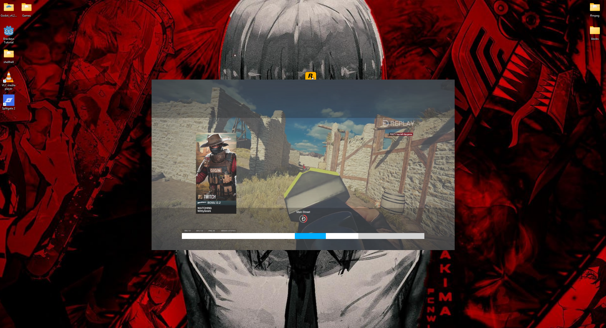

# gn
## Minimalist clipping software without the bloat
Easily record and trim clips and save to computer or upload to Google Drive



## Dependencies
- FFMPEG (decoding & trimming)
- libOBS (screen recording)
- SDL3 (main GUI)
- Win32 (background application)

## Building
```bash
# Get ffmpeg binaries with lib. Edit CMakeLists to the correct path of ffmpeg.

# Get libobs prebuilt from streamlabs https://obsstudios3.streamlabs.com/libobs-windows64-release-27.5.32.7z Edut CNakeLists to correct path.
# Example of using libobs is https://github.com/lulzsun/libobs-sharp/tree/main this repo uses a similar pattern

# Get SDL3 via command:
git clone https://github.com/libsdl-org/SDL.git vendored/SDL
# GET SDL3_ttf via command:
git clone --recursive https://github.com/libsdl-org/SDL_ttf.git vendored/SDL_ttf

# Run 
cmake -S . -B build
cmake --build build

```

## Usage
Background
- Shift+F4 (start/stop recording)
- Shift+F3 (open editor)

Editing
- Esc (close editor)
- Space (pause/unpause video)
- Left/Right / H/L (seek left and right)
- M (place marker)
- C (clear markers)
- E (export)
- S (open settings)
- N (open new capture)

SETTINGS
- Esc (close window)
- S (open editor)

## Disclaimer
Right now this application is only available on Windows. It is possible to make multiplatform, but right now it relies heavily on Win32 apis.
